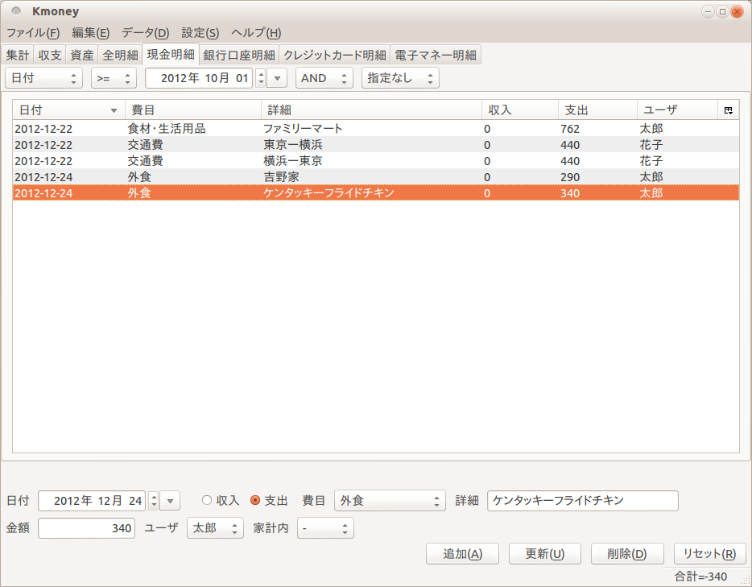
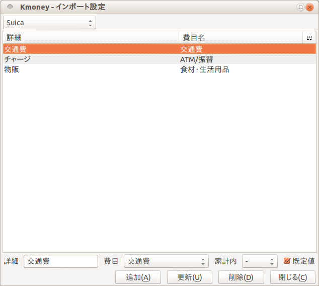
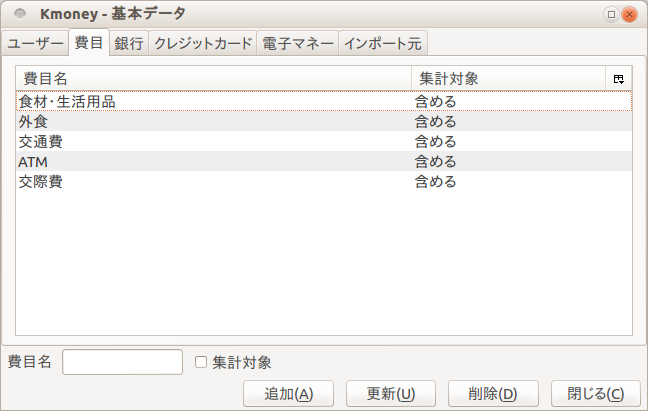

# Kmoney/PCの使い方

1. [初期設定](#init)
1. [データの入力](#input)
1. [インポート](#import)
1. [基本データの設定](#master)
1. [集計](#summary)
1. [収支](#balance)
1. [資産](#asset)
1. [オプション設定](#option)

## 初期設定

### データベースファイルの作成

はじめて起動した時は、新しいデータベースを作成するか既存のデータベースを開くかを選択するダイアログが表示されます。「新しいデータベースを作成する」を選択し、データベースファイルを作ってください。

### 基本データの入力

新しく作られたデータベースには、ユーザー名、費目、銀行名などのデータがあらかじめ数件入っています。メニューバーの「設定」ー「基本データ」で変更してお使いください。詳しくは「基本データの設定」で説明します。

## データの入力

日々の支出や収入は、「現金明細」「銀行口座明細」「クレジットカード明細」「電子マネー明細」のいずれかのタブを開いて入力します。

### 追加

画面の下のほうにある「日付」や「費目」を入力し、「追加」ボタンを押してください。上の表に入力内容が追加されます。

### 更新

入力内容を変更したい場合、表から変更したい行を選択してください。下のフィールドにその行の内容が表示されます。その内容を変更して「更新」ボタンを押してください。

複数行を一括して更新したい場合、表で複数選択して右クリックし、「更新」の下から項目を一つ選んでください。表示されたダイアログで更新内容を入力し、OKボタンを押すと、選択行のデータが更新されます。

### 削除

入力したデータを削除したい場合、その行を表から選択して「削除」ボタンを押してください。

複数行を一括して削除したい場合、表で複数選択して右クリックし、「削除」を選んでください。

### リセット

入力した日付や金額を取り消したい場合は「リセット」ボタンを押してください。この場合にはデータは更新されません。

### 「家計内」

銀行口座から現金を引き出した時や、電子マネーをチャージした時などは、「家計内」の選択リストから「自己」を指定してください。

家族とのあいだでお金を受け渡した時は、「家計内」の選択リストから「家族」を指定してください。

これらのデータは「集計」タブのグラフに表示するデータから除外されます。

### 支払い月

クレジットカードでの買い物をレシートから入力する場合、「支払い月」は空欄にしてください。あとで利用明細をみて「支払い月」を追加入力できます。

### 表示データの絞り込み

明細タブでは、表には先々月以降のデータだけが表示されています。この条件は表の上にある選択リストで変更できます。

## インポート

メニューバーの「ファイル」ー「インポート」により、ウェブ上で取得できる銀行口座の入出金明細やクレジットカードの利用明細をインポートすることができます。

### 入力ファイル

現在対応している入力ファイルは以下の通りです。

* 銀行
    * みずほ銀行の入出金明細(ofxファイル)
    * 新生銀行の入出金明細(csvファイル)
* クレジットカード
    * UCカードの利用明細(csvファイル)
    * セゾンカード(ウォルマートカード)の利用明細(csvファイル)
    * ビューカードの利用明細(HTMLファイル)
* 電子マネー
    * Suica(HTMLファイル)
* 他アプリ
    * かんたん家計簿(エクスポートしたデータベースファイル)

上記以外の場合でも、汎用の形式で入力されていればインポートできます。[インポートファイル仕様書](https://github.com/kazhik/Kmoney/wiki/%E3%82%A4%E3%83%B3%E3%83%9D%E3%83%BC%E3%83%88%E3%83%95%E3%82%A1%E3%82%A4%E3%83%AB%E4%BB%95%E6%A7%98%E6%9B%B8)をご覧ください。

### インポート設定

メニューバーの「設定」ー「インポート設定」で、インポートのルールを設定することができます。

銀行のファイルで、取引内容が「キュウヨ」となっている場合に費目を「給与」としたい場合、インポート設定ダイアログで「詳細」欄に「キュウヨ」と入力し、費目の選択リストから「給与」を選択します。

一つのインポート元について「既定値」のチェックボックスをONにしたデータを必ず一つ作ってください。ほかのルールに当てはまらないデータは全て「既定値」として設定された費目のデータとしてインポートされます。

### インポートされたデータの調整

レシートから入力したデータとインポートしたデータが重複してしまう場合もあります。インポート後にメニューバーの「データ」ー「重複行を表示」を選択すると、日付と金額が同じデータだけが表示されます。重複しているデータの一方を削除してください。

## 基本データの設定

### ユーザ

「ユーザー」タブでは家族の名前を入力してください。

### 費目

「費目」タブで費目を設定します。「集計対象」をチェックすると、その費目は「集計」タブの全費目のグラフを表示するときに集計対象となります。収入の費目は集計対象外としてください。集計タブでは支出を正の値として計算するため、収入は負の値として表示されてしまいます。また、クレジットカードの支払いや電子マネーのチャージを記録するための費目も集計対象外としてください。そうしないとクレジットカードや電子マネーを使って何かを買った時の支出と二重に計上されてしまいます。

すでにデータがある費目を削除しようとした場合、データの移行先を選択するダイアログが表示されます。例えば「電話」という費目を削除するとき、移行先として「通信費」を選択すると、費目が「電話」になっていたデータは「通信費」のデータになります。

### インポート元

「インポート元」タブは、インポートダイアログに現れるインポート元のリストを設定します。使わないインポート元は無効としてください。

## 集計／収支

「集計」タブで月々の費目ごとの収支を見ることができます。

表の上にある選択リストを使い、費目やユーザで絞り込むこともできます。

「グラフ」を選択すると、特定の費目の収支がグラフとして表示されます。

## 収支

「収支」タブでは、特定の銀行口座の収支をグラフで表示します。

表示される金額は指定期間の累積です。例えば2012年1月から10月を指定した場合、3月のところに表示される金額は1月から3月までの累積の収支です。

## 資産

「資産」タブは、貯蓄や負債を表示します。

現金明細か銀行口座明細で、表から特定の行を選択して右クリックすると、「資産として入力」というメニュー項目が表示されます。これを選択すると「資産」タブに移動し、選択行の内容が画面下のフィールドに表示されます。

個人の資産なら「種別」の選択リストで「個人」、家族の資産なら「家族」を選択してください。

「追加」ボタンでそのデータが資産として入力されます。

## オプション設定

メニューバーの「設定」ー「オプション」で設定を変更できます。

起動時に前回と同じデータベースを開きたい場合、「メイン」タブの「最後に利用したデータベースを開く」をチェックしてください。

明細タブで更新や削除を実行するとき、確認ダイアログが出ないようにしたい場合、「プロンプト」タブの「レコードの更新・削除」のチェックを外してください。

クレジットカードや電子マネーを使わない方は、「表示」タブの「クレジットカード」や「電子マネー」のチェックを外してください。

